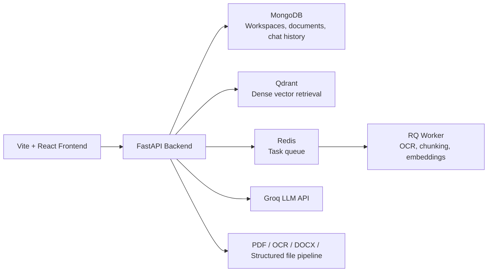

# NexusRAG

NexusRAG is a rebranded, portfolio-focused document intelligence platform built to move this project beyond a single-file RAG demo. The stack now targets a modern full-stack architecture with MongoDB-backed workspaces, Qdrant vector search, hybrid retrieval, and a streaming React interface designed around evidence-grounded chat.

## What Changed

- Rebranded the application from `TalkTonic` to `NexusRAG`
- Replaced the SQLite + in-memory FAISS direction with MongoDB + Qdrant service integrations
- Added workspace-aware document ingestion so multiple files can live inside a shared research context
- Upgraded retrieval to a hybrid dense + BM25 flow with optional cross-encoder reranking
- Added multi-turn conversational memory by replaying recent Mongo chat history into the LLM payload
- Moved document ingestion into a Redis-backed background queue so large uploads do not block the API
- Added server-sent event streaming for progressively rendered answers
- Migrated the frontend from Create React App toward a Vite + Tailwind experience with markdown rendering and a split-screen viewer
- Added Docker Compose plus Kubernetes manifests for cloud-native deployment framing

## Architecture



## Backend Highlights

- `backend/app.py` now owns a workspace-native API surface:
  - `POST /workspaces`
  - `GET /workspaces`
  - `POST /documents/upload`
  - `GET /tasks/{task_id}`
  - `GET /workspaces/{workspace_id}/documents`
  - `GET /documents/{document_id}/content`
  - `POST /chat`
  - `POST /chat/stream`
- Upload handling supports PDF, DOCX, TXT, image, CSV, and Excel inputs
- Semantic chunking preserves sentence boundaries and page metadata for citations
- Hybrid retrieval merges Qdrant vector hits with BM25 keyword scoring
- Recent chat turns are replayed into the Groq request for conversational memory
- Streaming responses arrive over SSE and can be rendered token-by-token in the UI
- Heavy ingestion work runs asynchronously through Redis + RQ

## Frontend Highlights

- `frontend` is now configured for Vite
- Tailwind powers the visual system and layout
- Chat responses render markdown tables and code blocks
- Assistant code blocks include syntax highlighting and copy actions
- The UI is structured around:
  - workspace management
  - multi-document uploads
  - split-screen evidence viewing
  - citation jump controls

## Local Run

1. Copy `.env.example` to `.env` and fill in `GROQ_API_KEY`.
2. Start the full stack:

```bash
docker compose up --build
```

3. Open the frontend at `http://localhost:5173`.

## Kubernetes Notes

Reference manifests live in `infra/k8s/`:

- `namespace.yaml`
- `mongodb.yaml`
- `qdrant.yaml`
- `redis.yaml`
- `backend.yaml`
- `frontend.yaml`
- `worker.yaml`
- `uploads-pvc.yaml`

These are intentionally lightweight deployment manifests meant to demonstrate orchestration intent and service boundaries in a portfolio setting.

## Showcase Test

The domain stress-test playbook for large quantitative research corpora lives in `docs/SHOWCASE_DOMAIN_TEST.md`.
